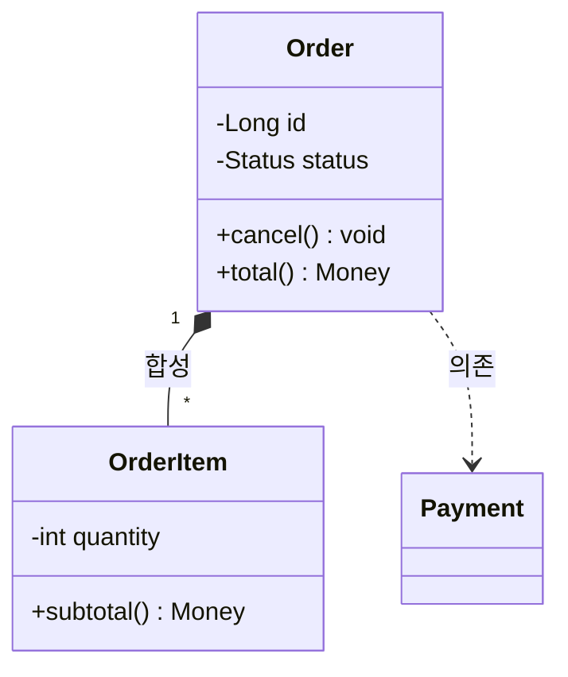
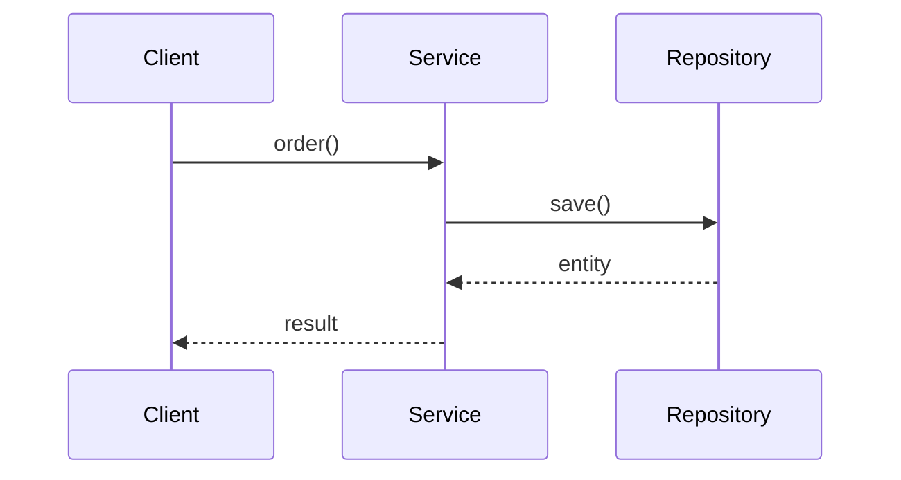

---
tags:
  - software-engineering
  - uml
  - modeling
  - design
created: 2026-06-17
---

# UML 모델링 (Unified Modeling Language)

> [!summary] 한 줄 요약
> **UML은 소프트웨어 설계를 시각적으로 표현·소통하기 위한 표준 표기법**이다. OMG 표준이며 Booch·Rumbaugh·Jacobson "Three Amigos"가 통합했다. 14개 다이어그램이 **구조(structural)** 와 **행위(behavioral)** 로 나뉘며, 실무에서는 클래스·시퀀스·유스케이스 셋을 가장 많이 쓴다. 코드와 동기화가 어려우므로 애자일에서는 **스케치 수준의 경량 사용**이 권장된다.

---

## 1. UML 개요

UML(Unified Modeling Language)은 **OMG(Object Management Group)** 가 관리하는 시각적 모델링 표준이다.

- **역사**: 1990년대 객체지향 설계 표기법이 난립하던 시기, Grady **Booch**, James **Rumbaugh**, Ivar **Jacobson**("Three Amigos")이 각자의 방법론을 통합해 1997년 **UML 1.x** 발표. 현재는 **UML 2.x**(2005~)가 표준이다.
- **목적**: 코드보다 추상화된 수준에서 **설계를 시각화하고 팀 간 소통**한다. 구현 전 구조·흐름을 합의하고, 문서로 남기는 용도.
- **분류**: UML 2.x는 **14개 다이어그램**을 정의하며 크게 두 축으로 나뉜다.

```text
UML 2.x 다이어그램 (14)
├── 구조(Structural) — "무엇이 있는가" (정적 구조)
│     클래스 · 객체 · 컴포넌트 · 배치 · 패키지 · 복합구조 · 프로파일
└── 행위(Behavioral) — "어떻게 동작하는가" (동적 흐름)
      유스케이스 · 시퀀스 · 활동 · 상태머신 · 커뮤니케이션 · 타이밍 · 상호작용개요
```

> 핵심: **구조 다이어그램은 정적 스냅샷**(클래스·관계), **행위 다이어그램은 시간에 따른 동작**(메시지·상태 변화)이다.

---

## 2. 구조 다이어그램 (Structural)

시스템의 **정적 구조**를 표현한다.

| 다이어그램 | 표현 대상 | 실무 빈도 |
|-----------|----------|----------|
| **클래스(Class)** | 클래스·속성·메서드·관계 | ★★★ (핵심) |
| **객체(Object)** | 특정 시점의 인스턴스 스냅샷 | ★ |
| **컴포넌트(Component)** | 모듈·인터페이스 단위 구성 | ★★ |
| **배치(Deployment)** | 노드·서버·실행 환경 물리 배치 | ★★ |
| **패키지(Package)** | 네임스페이스·모듈 그룹화 | ★★ |
| **복합구조(Composite Structure)** | 클래스 내부 협력 구조 | ★ |

### 2.1 클래스 다이어그램 ⭐ (가장 중요)

클래스의 **접근제어 · 속성 · 메서드 · 관계**를 표현한다.

```text
┌─────────────────────┐
│      Order          │  ← 클래스명
├─────────────────────┤
│ - id: Long          │  ← 속성 (접근제어 + 타입)
│ - status: Status    │
├─────────────────────┤
│ + cancel(): void    │  ← 메서드
│ + total(): Money    │
└─────────────────────┘
```

**접근제어 표기**:

| 기호 | 의미 | Java |
|------|------|------|
| `+` | public | public |
| `-` | private | private |
| `#` | protected | protected |
| `~` | package | (default) |

**관계 화살표 의미** (실무에서 가장 헷갈리는 부분):

```text
연관(Association)      A ──────► B     A가 B를 참조 (사용)
상속(Inheritance)      A ──────▷ B     A는 B의 자식 (빈 삼각형)
실현(Realization)      A ┈┈┈┈┈▷ B     A가 B 인터페이스 구현 (점선)
의존(Dependency)       A ┈┈┈┈┈► B     A가 B를 잠깐 사용 (파라미터 등)
집합(Aggregation)      A ◇──────  B     A가 B를 보유, B는 독립 생존 (빈 마름모)
합성(Composition)      A ◆──────  B     A가 B를 소유, A 소멸 시 B도 소멸 (찬 마름모)
```

> **집합 vs 합성**: 부서-직원은 집합(부서 없어져도 직원 존재), 주문-주문항목은 합성(주문 삭제 시 항목도 삭제). 생명주기 종속 여부가 기준.

**다중성(Multiplicity)**: 관계 양 끝에 개수를 표기한다.

```text
Order  1 ──────── * OrderItem      (주문 1개 : 항목 N개)
User   1 ──────── 0..1 Profile     (사용자 1 : 프로필 0 또는 1)
```

`1`(정확히 1), `*`(0 이상), `0..1`(0 또는 1), `1..*`(1 이상).

---

## 3. 행위 다이어그램 (Behavioral)

시스템의 **동적 동작·흐름**을 표현한다.

### 3.1 유스케이스 다이어그램

**액터(사용자/외부 시스템)** 와 **유스케이스(기능)** 의 관계로 요구사항을 표현한다.

```text
          ┌──────────────────────────────┐
  (액터)  │         주문 시스템            │
   👤 ────┤  ○ 상품 주문                  │
  고객    │  ○ 결제하기  ┄┄include┄┄►○ 검증 │
          │  ○ 주문 취소 ┄┄extend┄┄►○ 환불  │
          └──────────────────────────────┘
```

- **include(포함)**: 유스케이스가 **항상 다른 유스케이스를 포함**(결제 → 항상 검증).
- **extend(확장)**: **조건부로 확장**(취소 → 결제됐을 때만 환불).

### 3.2 시퀀스 다이어그램 ⭐ (가장 실무적)

객체 간 **메시지를 시간 순서대로** 표현한다. API 흐름·협력 설계에 가장 많이 쓰인다.

```text
Client      Controller     Service       Repository
  │             │             │              │
  │─ POST ─────►│             │              │   ← 동기 메시지 (실선 화살표)
  │             │─ order() ──►│              │
  │             │             │─ save() ────►│
  │             │             │◄┈ entity ┈┈┈│   ← 반환 (점선 화살표)
  │             │◄┈ result ┈┈┈│              │
  │◄┈ 201 ┈┈┈┈┈│             │              │
  │             │             │─ publish() ─►│   ← 비동기 (열린 화살표 ▻)
```

- **생명선(Lifeline)**: 각 객체 아래로 내려가는 세로선(객체의 존재 기간).
- **활성 박스(Activation)**: 메서드가 실행 중인 구간.
- **동기 메시지**: 채워진 화살표(`──►`), 응답을 기다림.
- **비동기 메시지**: 열린 화살표(`▻`), 응답을 안 기다림(이벤트·메시지 큐).

### 3.3 기타 행위 다이어그램

| 다이어그램 | 표현 대상 | 비유 |
|-----------|----------|------|
| **활동(Activity)** | 워크플로·분기·병렬 처리 | 순서도(flowchart) 강화판 |
| **상태머신(State Machine)** | 객체의 상태 전이 | 주문: 생성→결제→배송→완료 |
| **커뮤니케이션** | 객체 간 메시지(관계 중심) | 시퀀스의 다른 표현 |
| **타이밍(Timing)** | 시간축 상태 변화 | 임베디드·실시간 |

---

## 4. 실무 사용 — 상황별 다이어그램 선택

```text
요구사항 분석/범위 합의   → 유스케이스 (액터·기능 한눈에)
API·메서드 호출 흐름      → 시퀀스 (실무 1순위)
도메인 모델·엔티티 설계   → 클래스 (관계·다중성)
상태가 중요한 객체        → 상태머신 (주문/결제/티켓)
복잡한 비즈니스 프로세스  → 활동 (분기·병렬)
배포 토폴로지/인프라      → 배치 (서버·컨테이너)
```

> 14개를 다 그릴 필요 없다. 실무는 **유스케이스 + 클래스 + 시퀀스** 3종이 80%를 커버한다. → [[Development-Deliverables]]

---

## 5. 과하지 않게 — 애자일에서의 UML

UML을 모든 클래스·메서드까지 정밀하게 그리는 것은 **안티패턴**이다.

```text
⚠️ 문서화 함정
- 코드는 매일 바뀌는데 다이어그램은 안 따라옴 → 금세 거짓 문서가 됨
- 정밀한 UML 작성 = 코드를 두 번 짜는 비용
- 도구로 그린 무거운 다이어그램은 유지보수 부담
```

**경량(스케치) 사용 권장**:

- 화이트보드·냅킨 수준으로 **설계 합의용**으로만 그린다.
- 핵심 관계·흐름만, 모든 디테일은 코드에 맡긴다.
- 변하지 않는 **개념·아키텍처**는 문서로, 자주 바뀌는 디테일은 코드로.

> Martin Fowler의 표현: UML as **sketch**(소통) / blueprint(상세설계) / programming language(생성) 중 애자일은 대부분 **sketch**. → [[Development-Methodologies]]

---

## 6. 텍스트 기반 UML — PlantUML / Mermaid

다이어그램을 **코드(텍스트)로 작성** → Git 버전관리 가능, diff 추적, 코드 리뷰와 함께 변경. 그림 도구의 동기화 문제를 크게 줄인다.

**PlantUML** (시퀀스 예시):

```text
@startuml
actor Client
Client -> Controller : POST /orders
Controller -> Service : order()
Service -> Repository : save()
Repository --> Service : entity
Service --> Controller : result
Controller --> Client : 201 Created
@enduml
```

**Mermaid** (Markdown/Obsidian 네이티브 지원, 클래스 다이어그램 예시):



Mermaid 시퀀스 예시:



> Obsidian·GitHub·GitLab은 Mermaid를 렌더링한다. 노트·README·PR에 바로 다이어그램을 넣을 수 있어 실무에서 빠르게 확산 중.

---

## 7. 클래스 다이어그램 ↔ 코드 매핑

UML 클래스 다이어그램은 객체지향 코드와 거의 1:1로 대응한다.

```text
┌─────────────────────┐         ┌──────────────────┐
│      Order          │  1   *  │   OrderItem      │
├─────────────────────┤◆────────┤──────────────────┤
│ - id: Long          │ 합성    │ - quantity: int  │
│ - items: List       │         │ - price: Money   │
├─────────────────────┤         ├──────────────────┤
│ + cancel(): void    │         │ + subtotal(): Money │
└─────────────────────┘         └──────────────────┘
         ┊ 의존(uses)
         ▼
┌─────────────────────┐
│   <<interface>>     │
│   PaymentGateway    │
└─────────────────────┘
```

위 다이어그램의 Java 변환:

```java
public class Order {
    private Long id;                       // - id: Long
    private final List<OrderItem> items;   // 합성(composition): 소유
    private Status status;

    public void cancel() { /* ... */ }     // + cancel(): void
    public Money total() {                 // + total(): Money
        return items.stream()
            .map(OrderItem::subtotal)
            .reduce(Money.ZERO, Money::add);
    }

    // 의존(dependency): 파라미터로만 사용 → 필드로 보유 안 함
    public void pay(PaymentGateway gateway) {
        gateway.pay(total());
    }
}

public class OrderItem {                   // 합성 대상
    private int quantity;
    private Money price;
    public Money subtotal() { return price.multiply(quantity); }
}
```

**매핑 규칙 요약**:

| UML | Java |
|-----|------|
| 클래스 박스 | `class` |
| `<<interface>>` | `interface` |
| `+ / - / #` | `public / private / protected` |
| 합성(◆) | 필드로 보유 + 생명주기 소유 (`final List`) |
| 집합(◇) | 필드로 보유 (외부에서 주입, 독립 생존) |
| 의존(┈►) | 메서드 파라미터·지역변수 |
| 상속(▷) | `extends` |
| 실현(┈▷) | `implements` |
| 다중성 `*` | 컬렉션(`List`, `Set`) |

> 클래스 다이어그램과 도메인 모델은 [[DDD]]의 엔티티·애그리거트 설계와 자연스럽게 연결되고, 의존 방향 통제는 [[../spring/architecture/Hexagonal-Architecture]]의 포트·어댑터 설계로 이어진다.

---

## 관련
- [[Development-Deliverables]] — 설계 산출물 중 UML 다이어그램의 위치
- [[Development-Methodologies]] — 애자일/워터폴별 UML 활용 수준
- [[DDD]] — 도메인 모델링과 클래스 다이어그램의 연결
- [[../spring/architecture/Hexagonal-Architecture]] — 의존 방향 통제(포트·어댑터)와 구조 설계
